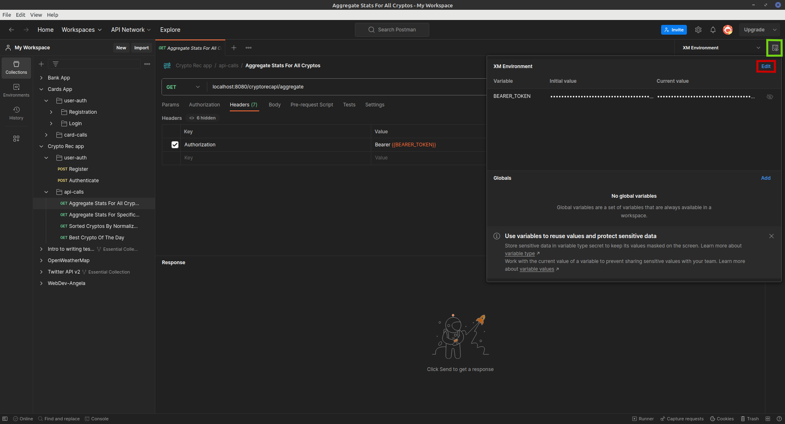
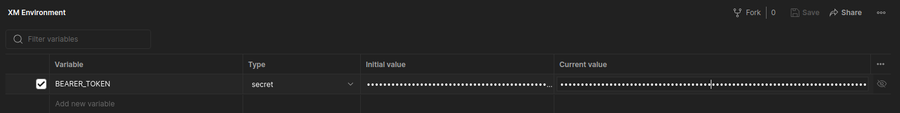
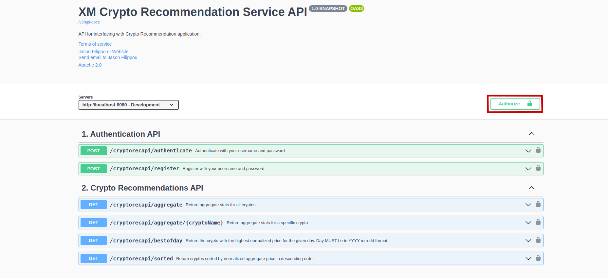
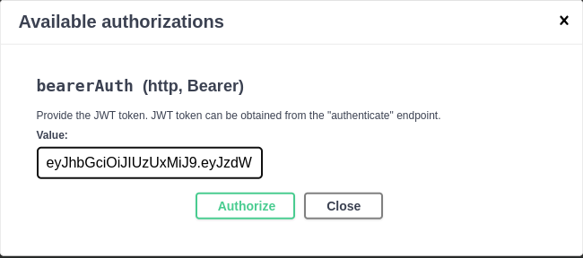

# README

# Table of Contents

1. [Getting Started](#getting-started)
   1. [Database](#database-)
   2. [Interacting with the API](#interacting-with-the-api)
      1. [Postman](#postman-)
      2. [OpenAPI](#openapi-)
   3. [User Registration & Authentication](#user-registration--authentication)
2. [Addressing writeup requirements](#addressing-requirements-from-writeup)
   1. [Reading prices from CSV files](#reading-all-prices-from-csv-files)
   2. [Calculating aggregate price stats](#calculating-aggregate-price-stats-min-max-first-last-difference-range)
   3. [Descending sorted list of cryptos](#descending-sorted-list-of-cryptos)
   4. [Aggregate stats for a given and for all cryptos](#aggregate-stats-for-a-given-crypto-and-all-cryptos)
   5. [Crypto with highest normalized range for given day](#crypto-with-highest-normalized-range-for-a-given-day)
3. [Addressing writeup "things to consider"](#addressing-things-to-consider-from-writeup)
   1. [Documentation](#documentation)
   2. [Scaling across multiple cryptos](#scaling-across-multiple-cryptos)
   3. [Safe-guarding against unsupported cryptos](#safe-guarding-against-not-currently-supported-cryptos)
   4. [Scaling across greater time ranges of price data](#scaling-across-greater-time-range-of-price-data)
4. [Addressing writeup "extra mile" items](#addressing-extra-mile-from-writeup)
   1. [Containerization](#containerization)
   2. [Endpoint Security](#endpoint-security)
5. [Logging details](#logging)
6. [Testing details](#testing)
8. [Exception handling](#exception-handling)
9. [Documentation details](#documentation-details)
10. [Implementation details](#implementation-details)
11. [Known Issues](#known-issues)

## Getting started

### Database 

The code has been developed and tested on a Linux Mint 20.2 Uma machine with kernel version `5.15.0-79-generic` and Java 17.
We employ a MySQL database for persistence (version `8.0.34-0ubuntu0.20.04.1` for Linux x86_64). The code creates and populates all
tables, so minimal database legwork is required.
You just need to create the database `xm_crypto_db`, a user named `xmcryptouser` with the provided password
and grant all privileges on `xm_crypto_db` to `xmcryptouser`. This is how we did it in our Linux machine (Windows users won't need this). Open up a shell and type:

```shell
sudo mysql --password 
```
Input your `sudo` password, and this should open up the `mysql` prompt, where you should type (Windows users _will_ need this as well):
```mysql
create database xm_crypto_db; -- Creates the new database
create user 'xmcryptouser'@'%' identified by 'ThePassword882100##'; -- Same password we have in the application.properties
grant all on xm_crypto_db.* to 'xmcryptouser'@'%'; -- Gives all privileges to the new user on the newly created database
```

You can now run the Spring Server by running the `CryptoRecServiceApplication` class. Once the server
is up - and - running, for security reasons, we recommend downgrading the privileges of `xmcryptouser` to just the absolutely 
necessary ones through the `mysql` prompt:

```mysql
revoke all on xm_crypto_db.* from 'xmcryptouser'@'%';
grant select, insert, delete, update on xm_crypto_db.* to 'xmcryptouser'@'%';
```

### Interacting with the API

You can use plain `curl` calls, a tool like POSTMAN or even OpenAPI 3.0 
Some details for Postman and OpenAPI follow.

#### Postman 

We provide a POSTMAN collection in the file `Crypto_Rec_App.postman_collection.json`. This file
has example calls that you can use to interact with the API. Every call to the
crypto API has the `Authorization` header assigned to the string `Bearer {{BEARER_TOKEN}}`, where
`{{BEARER_TOKEN}}` is a POSTMAN environment variable that contains the JWT
returned by the authentication endpoint (see below, section [User Registration & Authentication](#user-registration--authentication)). Here is how
you can set this variable. First, click on the <span style="color:lightgreen">Environment Quick Look" icon on the
upper-right corner</span>, then on <span style="color:red">"Edit"</span>:



This will pull up the "Environments" tab, and you can set a variable called
`BEARER_TOKEN` with the JWT as the current value.




#### OpenAPI 

We have prepared  an `OpenApi` bean in class `OpenAPI30Configuration` and have several annotations in our 
controllers and DTOs that make the OpenApi 3 page rendered in a user-friendly
fashion. Once the app is running, access the page by sending your browser to
http://localhost:8080/swagger-ui/index.html#.

To authenticate using the OpenAPI page, make the same `POST` call described above
to the `cryptorecapi/authenticate` endpoint (make sure the user has been registered first!), copy the JWT returned 
and then click on the <span style="color:red">Authorize button<span style="color:red">:



Paste the JWT and click on "Authorize":



This should now "unlock" all the crypto recommendations API REST calls so that you can perform them without
getting a 401 "Unauthorized" Http Status code.

An advantage of using the OpenAPI page over the Postman collection is better documentation of the endpoints,
with examples of the status codes that are returned. A disadvantage is that you will have to
re-authenticate if you refresh the page. 

### User Registration & Authentication

The API generates JWTs for authentication, with the secret stored in `application.properties`. The provided POSTMAN collection
shows some examples of user registration, but you can also use the OpenAPI page 
if you prefer. For example, `POST`-ing the following payload
to the `cryptorecapi/register` endpoint registers Jason Filippou:

```json
{
  "email" : "jason.filippou@gmail.com",
  "password" : "jasonfilippoupass"
}
```

Users are uniquely identified by their e-mail address; attempting to register the same e-mail 
twice will result in a `409 CONFLICT` Http Error Code sent back, alongside a descriptive message:

```json
{
    "message": "Username jason.filippou@gmail.com already in database."
}
```

After registering, you should receive a JSON with just your username (password ommitted for security) and a `201 CREATED` Http Response code:

```json
{
  "username": <THE_USERNAME_YOU_CHOSE>
}
```
Note that, in the database, passwords are encrypted using the BCrypt algorithm, so
the app admins cannot see the user's password in cleartext:

```mysql
mysql> select * from user where email_address='jason.filippou@gmail.com';
+----+--------------------------+--------------------------------------------------------------+
| id | email_address            | password                                                     |
+----+--------------------------+--------------------------------------------------------------+
|  1 | jason.filippou@gmail.com | $2a$10$TJ3qVcmo7UsUW/16dKchHe2YCVLN.whT4KBmMAdaMq9JhhIOIsdRK |
+----+--------------------------+--------------------------------------------------------------+
1 row in set (0.00 sec)
```

To receive the Bearer Token, `POST` the same payload
to the `/cryptorecapi/authenticate` endpoint, for example:

```json
{
    "email" : "jason.filippou@gmail.com",
    "password" : "jasonfilippoupass"
}
```
You should receive a JSON with your JWT alongside a `200 OK`. 

```json
{
    "jwtToken": <A_JWT>
}
```

The token has been configured to last 5 hours by default, but you can
tune that by changing the value of the variable `JWT_VALIDITY` in the `Constants` class.

## Addressing requirements from writeup

### Reading all prices from CSV files

At startup, the application reads all the prices from the CSV files into the MySQL
database. Every file will correspond to a new table in the database. We employ multiple
threads (a maximum of `10`, but you can tune this in the `Constants` class) to speed up this process.

### Calculating aggregate price stats (min, max, first, last, difference, range)

To make most of the endpoints super - efficient, the aggregate stats for the entire month
are eagerly loaded in an in-memory "database" (a thread-safe `Map`) right after the MySQL
persistence has taken place. This also employs multiple threads to speed up the process.

The database persistence and in-memory stats aggregation begins in the `CommandLineRunner`
bean in `PreloadDatabase.java`, so you can start reading from there. By splitting the work across
multiple workers, in our machine and with the original 5 CSVs, the entire process takes about 2.2 seconds.

### Descending sorted list of cryptos

Performing a `GET` call at the endpoint `/cryptorecapi/sorted` will return a 
list of `<crypto, normalized_price>` pairs sorted in descending order of normalized price. With the original
5 CSVs provided, this is what the endpoint returns:

```json
{
    "ETH": 0.6383810111,
    "XRP": 0.5060541311,
    "DOGE": 0.5046511628,
    "LTC": 0.4651837524,
    "BTC": 0.4341211044
}
```

It appears that over the month of January 2022, for which we have data, Ethereum offered the best normalized price. We offer
10 decimal digits of numerical accuracy both in the application and in the database.

### Aggregate stats for a given crypto and all cryptos

We offer two `GET` endpoints for this requirement:

- The `cryptorecapi/aggregate` endpoint will return a payload with the aggregate stats of *all* cryptos.
The sorting in this case is done lexicographically by name of crypto, in ascending order. This is what it returns
for the given `.csv` files:

```json
{
    "BTC": {
        "minPrice": 33276.59,
        "maxPrice": 47722.66,
        "firstPrice": 46813.21,
        "lastPrice": 38415.79,
        "priceRange": 14446.07,
        "priceDifference": -8397.42,
        "normalizedPrice": 0.4341211044
    },
    "DOGE": {
        "minPrice": 0.129,
        "maxPrice": 0.1941,
        "firstPrice": 0.1702,
        "lastPrice": 0.1415,
        "priceRange": 0.0651,
        "priceDifference": -0.0287,
        "normalizedPrice": 0.5046511628
    },
    "ETH": {
        "minPrice": 2336.52,
        "maxPrice": 3828.11,
        "firstPrice": 3715.32,
        "lastPrice": 2672.5,
        "priceRange": 1491.59,
        "priceDifference": -1042.82,
        "normalizedPrice": 0.6383810111
    },
    "LTC": {
        "minPrice": 103.4,
        "maxPrice": 151.5,
        "firstPrice": 148.1,
        "lastPrice": 109.6,
        "priceRange": 48.1,
        "priceDifference": -38.5,
        "normalizedPrice": 0.4651837524
    },
    "XRP": {
        "minPrice": 0.5616,
        "maxPrice": 0.8458,
        "firstPrice": 0.8298,
        "lastPrice": 0.5867,
        "priceRange": 0.2842,
        "priceDifference": -0.2431,
        "normalizedPrice": 0.5060541311
    }
}
```

- The `cryptorecapi/aggregate/{cryptoName}` endpoint will return a payload with the aggregate
stats of the provided `{cryptoName}`. For example, a `GET` at `cryptorecapi/aggregate/XRP` will return:

```json
{
    "minPrice": 0.5616,
    "maxPrice": 0.8458,
    "firstPrice": 0.8298,
    "lastPrice": 0.5867,
    "priceRange": 0.2842,
    "priceDifference": -0.2431,
    "normalizedPrice": 0.5060541311
}
```

Providing a crypto that we do not yet support (e.g Tether, with code `USDT`) will return a `404 NOT FOUND`
Http Error and a descriptive message:

```json
{
    "message": "Crypto USDT not currently supported."
}
```

### Crypto with highest normalized range for a given day

For this requirement, we go back to the on-disk database since maintaining stats for every
day in memory would be prohibitively expensive. We once again employ a fixed thread pool with a
maximum number of 10 threads to speed up the computation across all cryptos.

<strong>We require that days are provided in a YYYY-mm-dd format, e.g "2022-01-01".</strong> If the user does not provide
the date in this format, we return a `400 BAD REQUEST` HTTP Error code and a descriptive text:

```json
{
    "message": "Date 01/02/2022 not in YYYY-mm-dd format."
}
```

It appears that for 2022-01-01 (the first day for which the original files give us data), the 
"best scoring" crypto was `XRP`:

```json
{
    "XRP": 0.0192817546
}
```

whereas for the 8th of January 2022 (2022-01-08), it was `ETH`:

```json
{
    "ETH": 0.0704867042
}
```

For a given date, the implementation only compares cryptos that actually have data for that given date.
For the files that are given to us, this is not a problem, since all cryptos have _some_ data for all dates,
but we also make sure that we handle the situation where some crypto might not have data for a given date.

If a date for which no crypto has any data is provided, a `404 NOT FOUND` HTTP error is returned,
alongside a descriptive message:

```json
{
    "message": "Day 2022-02-01 out of stored range of dates for all cryptos"
}
```

For the implementation of this endpoint, please refer to the methods `CryptoRecController::bestCryptoOfTheDay()`
and `CryptoRecService::getBestCryptoForDate()`.

## Addressing "things to consider" from writeup

### Documentation

We hope that we have provided sufficient documentation for this exercise. Please refer
to the [Documentation](#documentation) section of this writeup for a summary.

### Scaling across multiple cryptos

The application scales well in the face of several cryptos, because we employ multiple threads to preload the database, and to address the requirements of the
"best crypto of the day" endpoint. 

### Safe-guarding against not currently supported cryptos

The application is robust against not currently supported cryptos. At 
startup, it determines the set of acceptable cryptos via the CSV files present in the `./task/prices` directory.
Then, as described [above](#aggregate-stats-for-a-given-crypto-and-all-cryptos), the application will serve the 
user with a `404` if they attempt to return results for an unsupported crypto.

### Scaling across greater time range of price data

In this case, the application is *not* robust! This is because at startup, every worker that we spawn for a given CSV file
reads the entire file in memory, and then persists the data on disk. This means that it is possible that, for a much larger CSV
file than the ones that we have been given, we receive an `OutOfMemoryError`. 

A good way to fix this would be to read the CSV files in chunks of, say, 100 rows each
and persist every 100 rows in the database. Perhaps the `FileReader` instance underneath the `CSVReader` instance
that we employ could be leveraged for this. This would make the startup slower, since we increase the number 
of database calls performed for the largest file, but it would safe-guard against `OutOfMemoryError` exceptions.

## Addressing "extra mile" from writeup

### Containerization

We unfortunately do not currently have the knowledge to containerize the application. To do this, we would need to 
pull the MySQL dependency through a `docker-compose` YAML file. We have seen such files and workflows in production,
but need some additional time to study Docker to be able to perform this step. For now, the application requires 
a version of MySQL installed in the user's computer and for the user to perform the steps mentioned in 
the [Getting Started - Database](#database-) section.

### Endpoint Security

We offer a full-fledged JWT Authentication - based mechanism backed by our MySQL database. Users of the application
first need to make a `POST` to `cryptorecapi/register` with their e-mail and password, and, if their
registration is successful, can obtain a JWT from the `cryptorecapi/authenticate` endpoint. The entire process
is explained in [User Registration & Authentication](#user-registration--authentication).

The following classes will be interesting to look at to see how we implement the authentication flow:

- `JwtAuthenticationController`
- `JwtAuthenticationEntryPoint`
- `PasswordEncoderConfig`
- `SecurityConfig`
- `JwtRequestFilter`
- `JwtTokenUtil`
- `JwtAuthenticationService`
- `JwtUserDetailsService`

## Logging

We employ basic AOP features to offer logging on-demand for any class' methods. The custom annotation
`@Logged` can be applied to any class we desire and offer logging at the `INFO` and `WARN` levels for entrance
into a method, exit from a method as well as exception throwing from a method.

Have a look at the package `com.xm.cryptorecservice.util.logger` for more.
## Testing

As of the 6th of September, we did not have the necessary time to implement unit and integration tests.
We wanted to provide a version of the app that we have found manually to be working early, so as to speed up the code 
review process. Time permitting, until the time of the code review, tests will be added and this README section will be edited.

For examples of how we write unit and integration tests, please take a look at [this](https://github.com/jasonfilippou/agile-bank)
and [this](https://github.com/jasonfilippou/cards-spring-app) repo, which contain coding exercises in Spring performed
for some other companies in the past. We employ [Mockito](https://site.mockito.org/) for mocked testing. For integration testing,
we employ an H2 database and load the entire Spring context.

## Exception handling

All exceptional situations are decorated with Exception Advices implemented in
the class `ExceptionAdvice`. We do this to have a centralized location from which we can assign a custom `Exception` to a 
desired HTTP Error code. For example, we associate the `UnsupportedCryptoException` and
`DateOutOfStoredRangeException` classes with a `404 NOT_FOUND` HTTP error code, and the `EmailAlreadyInDatabaseException`
class with a `409 CONFLICT` HTTP error code.

Have a look at the package `com.xm.cryptorecservice.util.exceptions` for details.

## Documentation details

We include the present `README` file, a POSTMAN collection, OpenAPI page and JavaDocs, the latter 
being generated under the `/doc` directory.

## Implementation details

The version of Java used is 17 and that of Spring Boot is 3.1.3. We pull several interesting dependencies in our `pom.xml`,
such as:

- [OpenCSV library](https://opencsv.sourceforge.net/) for CSV parsing
- [Guava](https://github.com/google/guava) mainly for synchronized maps
- [Hibernate validators](https://hibernate.org/validator/#:~:text=Hibernate%20Validator%20allows%20to%20express,server%20and%20client%20application%20programming.) to validate path variables and request parameters
- [Lombok](https://projectlombok.org/) to avoid boiler-plate code.
- [Spring Boot Starter Data JPA](https://mvnrepository.com/artifact/org.springframework.boot/spring-boot-starter-data-jpa)
- [Spring Boot Starter Security](https://mvnrepository.com/artifact/org.springframework.boot/spring-boot-starter-security)

and several others. To interact with the database, we use both the JPA Repository pattern
and interacting directly with a `JdbcTemplate` instance. The JPA Repository pattern is used only for 
user registration and authentication, since we already know the table name and fields in advance. All other
database interface calls are done through a wired-in `JdbcTemplate` that gets configured in the `application.properties` file.

All multi-threaded workflows employ a fixed thread pool generated by `java.util.concurrent.Executors`. The parent thread
waits for the workers to complete by calling `await()` on a shared `CountDownLatch` instance. Care has been applied to
make all operations on shared variables thread-safe (for example, by employing concurrent maps or ensuring that the different
workers don't structurally modify shared variables).

For the initial population of the MySQL database, batch inserts, with a batch size of 100, are used.

The method `CryptoRecService::getBestCryptoOfDate()` is the most interesting one from an algorithmic perspective,
since it could employ one of two different synchronized `Map` implementations to achieve its goals. Feel free to have a look at the comments
inside the method for details.

The data type we employ for cryptocurrency prices is `BigDecimal`, and we offer 10 decimal digits of numerical
accuracy both at the database level and in-memory.

We achieve dependency injection transparently, without any `@Autowired` annotations, by making dependencies
`private` and `final` in the target class and using Lombok's `@RequiredArgsConstructor` annotation. Of course, `@Component`,
`@RestController`, `@Service` and `@Repository` annotations are used as required.

IntelliJ Ultimate edition was used, employing the `google-java-format` plugin for formatting.
## Known Issues

- In the `/cryptorecapi/aggregate/{crypto}` endpoint, if you neglect to pass in the
  path variable `{crypto}` you will get a `401 Unauthorized` HTTP Error. This is because of the way that the `commence()` method has been overloaded in
  `JwtAuthenticationEntryPoint` and could probably have been handled better. This error is not reproducible in Swagger,
since Swagger does some elementary field cleansing of its own and does not allow you to put in nothing for `{crypto}`.
- We use the Hibernate `@Email` validator for validating e-mails, and that validator is sensitive to leading / trailing whitespace. Please
  be careful when typing e-mail addresses in authentication endpoints.
- As mentioned [above](#scaling-across-greater-time-range-of-price-data), it is possible that, for a very large CSV file,
we encounter an `OutOfMemoryError` and are unable to persist the data in the MySQL database.